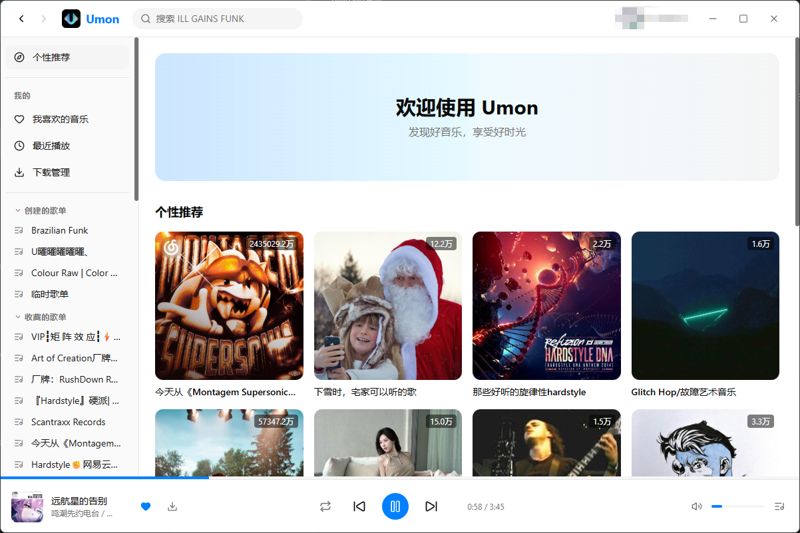
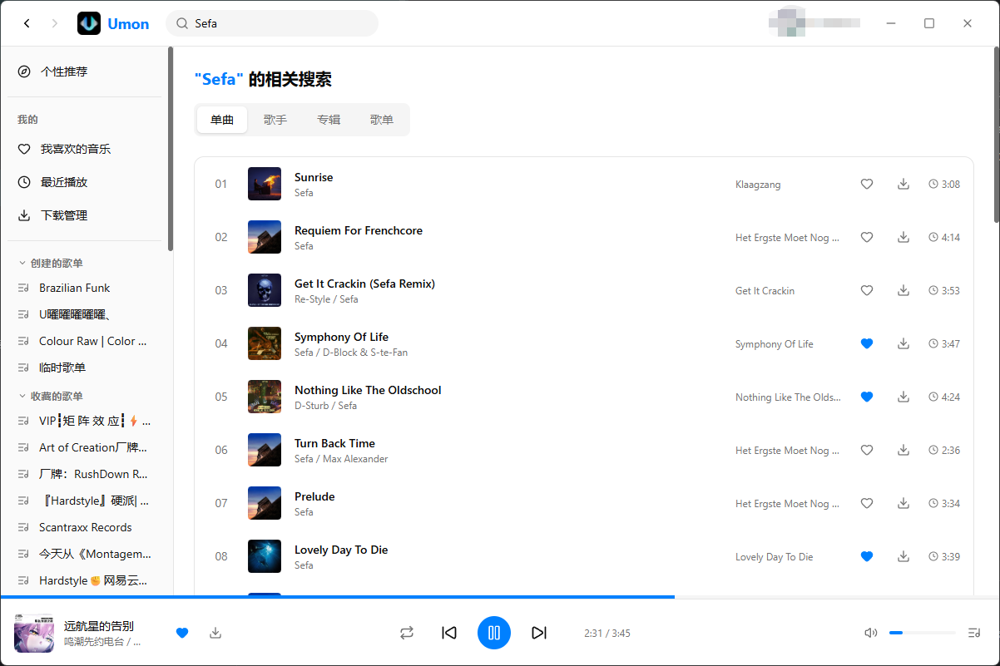
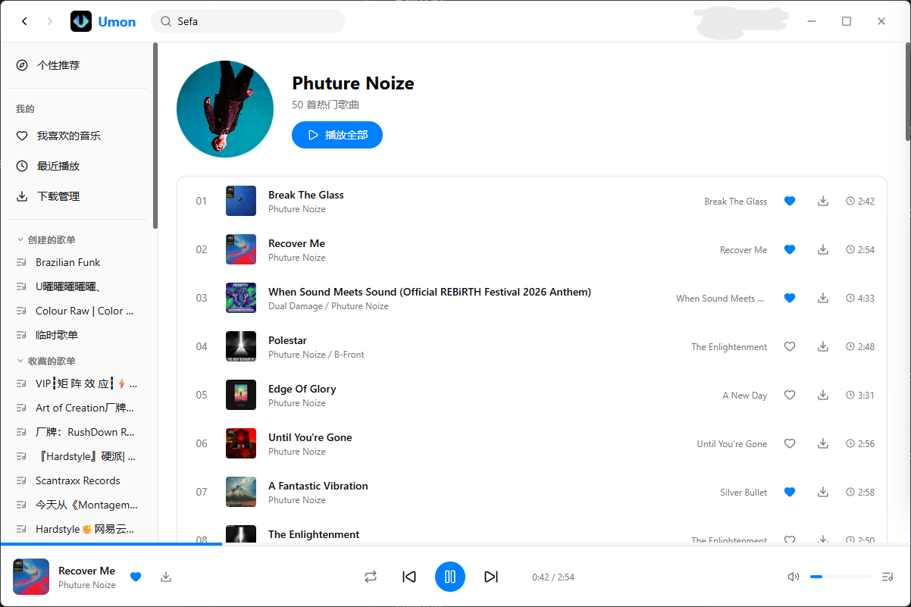
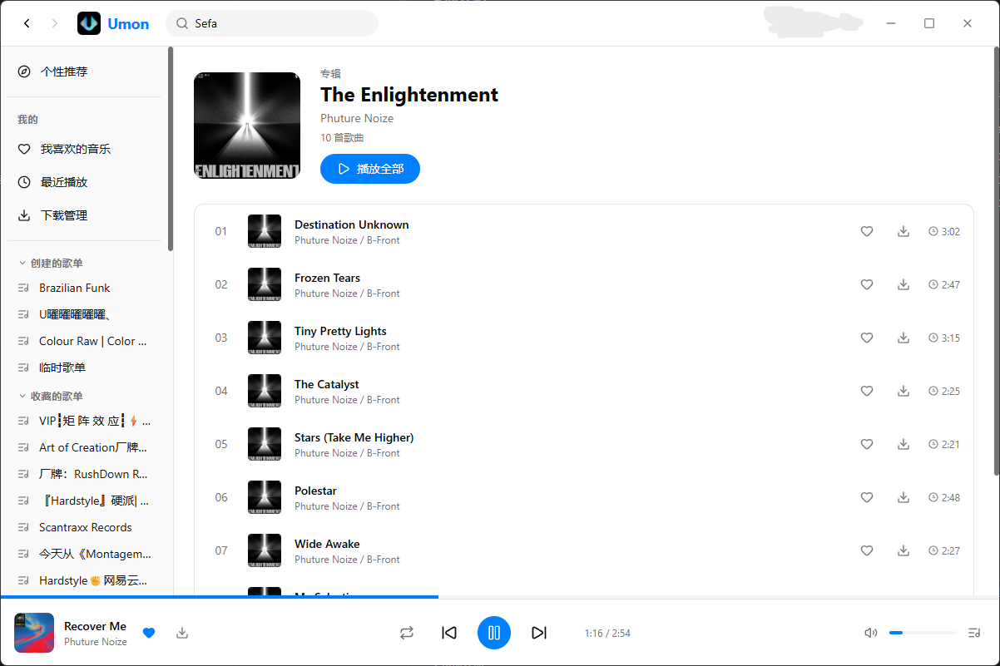
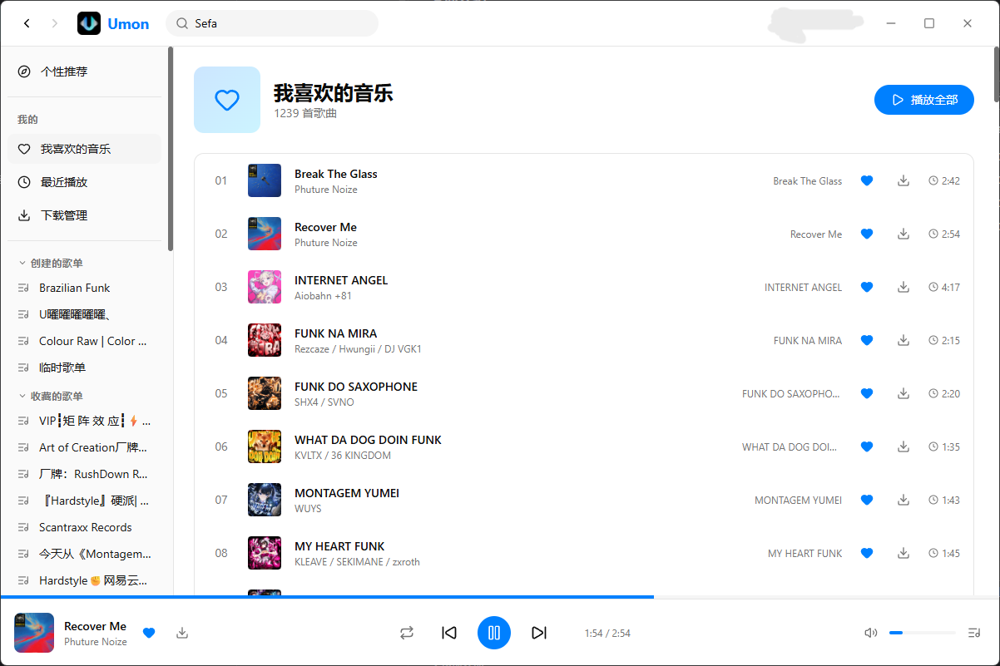
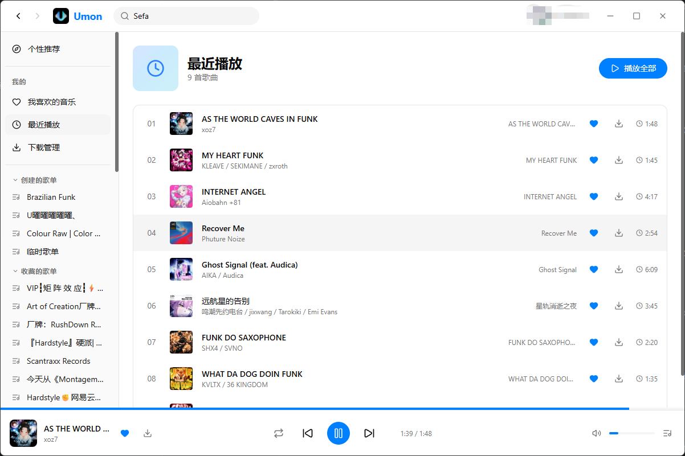
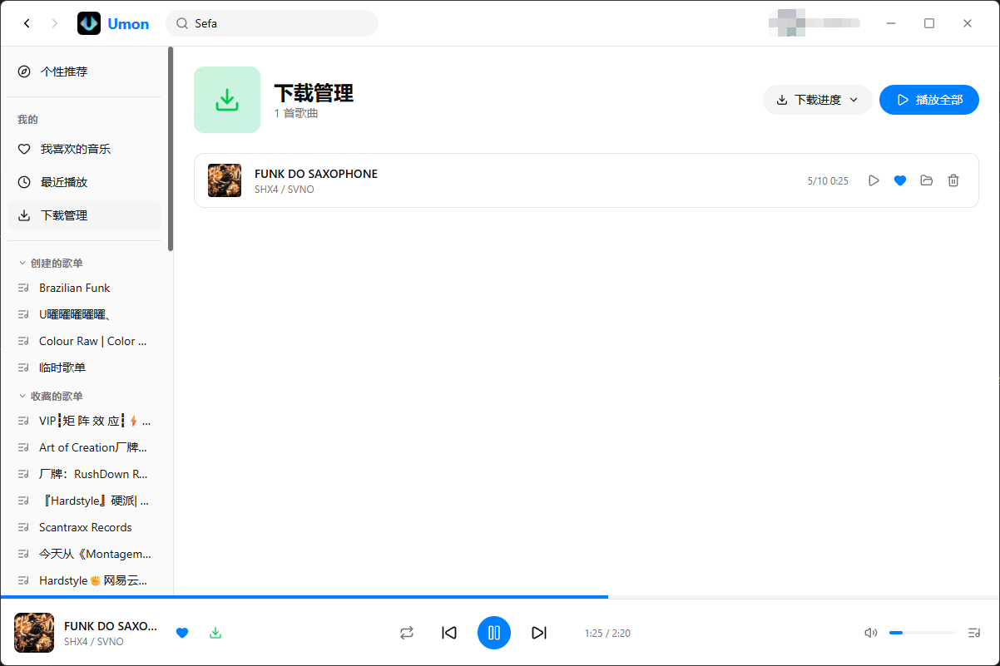
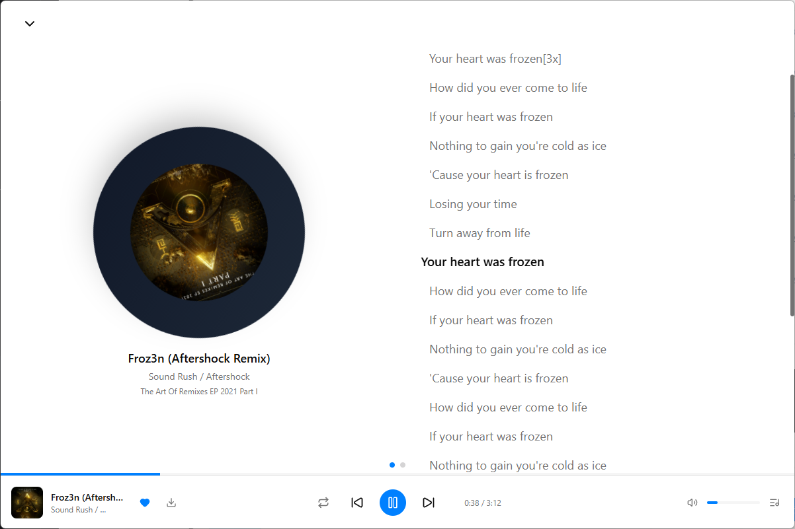

<p align="center">
  
</p>

<h1 align="center">Umon</h1>

<p align="center">A cross-platform net music player</p>
<p align="center">跨平台网络音乐播放器</p>

<p align="center">
  
  
  
  
  
</p>

---

## 中文 | [English](#english)

### 技术栈

| 类别 | 技术 |
|------|------|
| **框架** | [Vue 3](https://vuejs.org/) (`<script setup>`) |
| **语言** | [TypeScript](https://www.typescriptlang.org/) (严格模式) |
| **构建工具** | [Vite](https://vitejs.dev/) |
| **桌面运行时** | [Electron](https://www.electronjs.org/) |
| **状态管理** | [Pinia](https://pinia.vuejs.org/) (Setup Store) |
| **路由** | [Vue Router 4](https://router.vuejs.org/) |
| **样式** | [Tailwind CSS 4](https://tailwindcss.com/) |
| **图标** | [Lucide Vue](https://lucide.dev/) |
| **HTTP 客户端** | [Axios](https://axios-http.com/) |
| **打包工具** | [electron-builder](https://www.electron.build/) |

### 支持平台

Umon 同时支持网页端和桌面端，共享 100% 的 UI 代码。桌面端独有功能（本地下载、原生窗口控制、文件夹管理）在网页端会自动隐藏。

| 平台 | 状态 |
|------|------|
| **Web**（任意现代浏览器） | 已支持 |
| **Windows**（NSIS 安装包 / 便携版 exe） | 已支持 |
| **macOS**（DMG） | 已支持 |
| **Linux**（AppImage） | 已支持 |

### Demo
https://y.uuuuu.su

### 快速开始

**环境要求：**
- [Node.js](https://nodejs.org/) >= 18
- 一个运行中的音乐 API 后端实例

```bash
# 克隆仓库
git clone https://github.com/UmocxZzZ/Umon.git
cd Umon

# 安装依赖
npm install

# Web 开发
npm run dev

# Electron 桌面端开发
npm run dev:electron
```

**构建：**

```bash
# Web 静态文件 → dist/
npm run build:web

# Electron 桌面应用 → release/
npm run build:electron

# Electron 便携版 exe
npm run build:electron-portable
```

**部署到服务器：**

```bash
npm run build:web
scp -r dist/* user@your-server:/var/www/your-domain.com/
# 参考 nginx.conf.example 配置反向代理
```

### 页面介绍

#### 发现页（首页）

首页展示欢迎横幅、个性化推荐歌单（4 列网格）和新歌速递列表。播放量以中文单位格式化显示。点击歌单卡片跳转详情页，点击歌曲行立即播放。



#### 搜索

支持四个标签页的全局搜索：**单曲**、**歌手**、**专辑**、**歌单**。单曲以表格形式展示封面、歌名、歌手、专辑和时长；歌手以圆形头像网格展示；专辑和歌单以方形封面网格展示。所有结果并行获取。



#### 歌手页

展示歌手圆形头像、名称、热门歌曲数量和「播放全部」按钮。歌曲列表支持双击播放、红心收藏和下载（桌面端）。歌手名可点击跳转到对应歌手页。



#### 专辑页

展示专辑封面、名称、歌手、曲目数和「播放全部」按钮。曲目列表与其他页面布局一致。歌手名可点击跳转。



#### 我喜欢的音乐

展示用户喜欢的歌曲列表。使用 `IntersectionObserver` 实现**无限滚动**分页加载（每批 100 首），避免大歌单超时。显示总曲目数，支持「播放全部」。



#### 最近播放

播放历史列表，数据来自播放器 store 的内存记录。歌曲去重，最新播放排在最前面，持久化到本地存储，无需 API 请求。



#### 下载管理

桌面端专属页面。浮动进度面板展示每首歌的下载进度条、速度、已下载/总大小、暂停/恢复/取消控制和批量操作。主列表自动检测缺失文件并提供重新下载。状态图标区分已完成、活跃、暂停和错误状态。



#### 底栏播放器

固定在窗口底部的播放控制栏。包含可拖拽进度条、歌曲信息（封面缩略图点击打开沉浸式播放页）、播放控制（上一首、播放/暂停带加载状态、下一首）、播放模式切换（列表循环、单曲循环、随机播放）、音量滑块和播放列表抽屉开关。


#### 沉浸式播放页

从底部滑出的全屏覆盖层，通过鼠标滚轮切换两页：

- **第一页 · 歌词**：左侧旋转唱片风格的专辑封面（播放时旋转），右侧同步滚动歌词，当前行高亮平滑自动滚动。
- **第二页 · 热评**：热门评论，懒加载。每条评论展示头像、昵称、内容和点赞数。

底部有页码指示器圆点，左上角有收起按钮。



#### 全局设置

- **API 路径**：覆盖默认 API 服务器地址（持久化到 localStorage）
- **下载文件夹**（桌面端）：通过原生文件夹选择器自定义下载目录
- **关于 Umon**：应用 Logo、版本号、作者信息、GitHub 项目地址和更新检查

#### 登录

扫码登录。页面每 2 秒轮询扫码状态，带颜色反馈（等待中、已扫码、成功、已过期）。登录成功后存储 cookie 并跳转到发现页。


### 项目结构

```
Umon/
├── electron/             # Electron 主进程
│   ├── main.ts           # 窗口创建、IPC、Cookie 注入、下载器
│   └── preload.ts        # contextBridge API 暴露
├── src/
│   ├── assets/           # 静态资源（Logo 等）
│   ├── components/
│   │   ├── layout/       # TopBar、SideBar、BottomPlayer、FullScreenPlayer、PlaylistDrawer
│   │   ├── ArtistLinks.vue
│   │   └── DownloadDialog.vue
│   ├── composables/      # useToast
│   ├── lib/              # API 层（axios、API 函数）、工具函数
│   ├── stores/           # Pinia Store（auth、player、likes、downloads、settings）
│   ├── types/            # TypeScript 接口定义
│   ├── views/            # 路由级页面组件
│   ├── App.vue           # 根组件
│   ├── main.ts           # 应用入口
│   ├── env.d.ts          # ElectronAPI 类型声明
│   └── router.ts         # Vue Router 配置
├── nginx.conf.example    # Nginx 部署模板
├── electron-builder.json # Electron 打包配置
├── index.html            # HTML 入口
├── vite.config.ts        # Vite + Electron 插件配置
└── package.json
```

### 架构亮点

- **统一代码库**：单一 Vue 3 代码库同时服务 Web 和桌面端。通过 `window.electronAPI` 检测优雅启用桌面端专属功能。
- **Cookie 注入**：桌面端通过 Electron 的 `webRequest.onBeforeSendHeaders` 注入 Cookie，绕过 `file://` 协议限制。Web 端通过自定义 `X-Umon-Cookie` 请求头传递，由 nginx 转换为标准 Cookie 头。
- **主题系统**：蓝青渐变品牌色（`#0080FF` → `#00FFFF`），支持浅色/深色模式。
- **状态持久化**：登录 Cookie、设置和播放历史持久化到 localStorage。下载记录通过 Pinia 管理并检测文件是否存在。

---

<a id="english"></a>

## English | [中文](#中文--english)

### Tech Stack

| Category | Technology |
|----------|------------|
| **Framework** | [Vue 3](https://vuejs.org/) (`<script setup>`) |
| **Language** | [TypeScript](https://www.typescriptlang.org/) (strict mode) |
| **Build Tool** | [Vite](https://vitejs.dev/) |
| **Desktop Runtime** | [Electron](https://www.electronjs.org/) |
| **State Management** | [Pinia](https://pinia.vuejs.org/) (Setup Store) |
| **Routing** | [Vue Router 4](https://router.vuejs.org/) |
| **Styling** | [Tailwind CSS 4](https://tailwindcss.com/) |
| **Icons** | [Lucide Vue](https://lucide.dev/) |
| **HTTP Client** | [Axios](https://axios-http.com/) |
| **Packaging** | [electron-builder](https://www.electron.build/) |

### Supported Platforms

Umon runs seamlessly across Web and Desktop, sharing 100% of the UI code. Desktop-exclusive features (local file download, native window controls, folder management) are gracefully hidden in the Web version.

| Platform | Status |
|----------|--------|
| **Web** (any modern browser) | Supported |
| **Windows** (NSIS installer / Portable exe) | Supported |
| **macOS** (DMG) | Supported |
| **Linux** (AppImage) | Supported |

### Demo
https://y.uuuuu.su

### Getting Started

**Prerequisites:**
- [Node.js](https://nodejs.org/) >= 18
- A running music API backend instance

```bash
# Clone the repo
git clone https://github.com/UmocxZzZ/Umon.git
cd Umon

# Install dependencies
npm install

# Web development
npm run dev

# Electron desktop development
npm run dev:electron
```

**Build:**

```bash
# Web static files → dist/
npm run build:web

# Electron desktop app → release/
npm run build:electron

# Electron portable exe only
npm run build:electron-portable
```

**Deploy to Server:**

```bash
npm run build:web
scp -r dist/* user@your-server:/var/www/your-domain.com/
# See nginx.conf.example for reverse proxy configuration
```

### UI & Features

#### Discover (Home)

The landing page with a welcome banner, personalized playlist recommendations in a 4-column grid, and a new songs list. Play counts are formatted with Chinese units. Clicking a playlist card navigates to its detail page; clicking a song row starts playback immediately.


#### Search

A full-featured search with four result tabs: **Songs**, **Artists**, **Albums**, and **Playlists**. The songs tab shows a table with cover, name, artist, album, and duration. Artists display in a circular avatar grid; albums and playlists in a square cover grid. All results are fetched in parallel.


#### Artist Page

Displays the artist's circular avatar, name, song count, and a "Play All" button. The hot songs list supports double-click to play, heart toggle, and download (Desktop). Artist names are clickable links that navigate to other artist pages.


#### Album Page

Shows the album cover, name, artist, and track count with a "Play All" button. The track list follows the same layout as other song lists. Artist names link to the artist page.


#### Favorites (Liked Music)

Displays the user's liked songs playlist. Uses **infinite scroll** with `IntersectionObserver` to load tracks in pages of 100, avoiding timeout on large playlists. Shows total track count and supports "Play All".


#### Recent Play

A play history list sourced from the player store's in-memory history. Songs are deduplicated with the most recent at the top, persisted to localStorage. No API calls required.


#### Download Manager

A Desktop-exclusive page for managing all downloads. Features a floating progress panel with per-song progress bars, speed display, pause/resume/cancel controls, and bulk actions. The main list detects missing files and offers re-download. Status-aware icons distinguish completed, active, paused, and errored downloads.


#### Bottom Player

A persistent playback bar fixed at the bottom of the window. Contains a draggable progress bar, song info with cover thumbnail (click to open fullscreen player), playback controls (previous, play/pause with loading state, next), play mode toggle (list repeat, single repeat, shuffle), volume slider, and playlist drawer toggle.


#### Fullscreen Player

An immersive overlay that slides up from the bottom. Two pages switchable by mouse wheel:

- **Page 1 — Lyrics**: A spinning vinyl-disc album cover on the left, synchronized scrolling lyrics on the right. The active lyric line is highlighted with smooth auto-scroll.
- **Page 2 — Comments**: Hot comments, loaded lazily when the user scrolls to this page. Each comment shows avatar, username, content, and like count.

Page indicator dots at the bottom and a close button at the top left.


#### Settings

- **API Path**: Override the default API server address (persisted to localStorage)
- **Download Folder** (Desktop): Choose a custom download directory via native folder picker
- **About**: App logo, version number, author credit, GitHub project link, and update checker


#### Login

QR code authentication. The page polls for scan status every 2 seconds with color-coded feedback (waiting, scanned, success, expired). On success, the cookie is stored and the user is redirected to Discover.


### Project Structure

```
Umon/
├── electron/             # Electron main process
│   ├── main.ts           # Window creation, IPC, cookie injection, downloads
│   └── preload.ts        # contextBridge API exposure
├── src/
│   ├── assets/           # Static assets (logo, etc.)
│   ├── components/
│   │   ├── layout/       # TopBar, SideBar, BottomPlayer, FullScreenPlayer, PlaylistDrawer
│   │   ├── ArtistLinks.vue
│   │   └── DownloadDialog.vue
│   ├── composables/      # useToast
│   ├── lib/              # API layer (axios, api functions), utilities
│   ├── stores/           # Pinia stores (auth, player, likes, downloads, settings)
│   ├── types/            # TypeScript interfaces
│   ├── views/            # Route-level components
│   ├── App.vue           # Root component
│   ├── main.ts           # App entry point
│   ├── env.d.ts          # ElectronAPI type declarations
│   └── router.ts         # Vue Router config
├── nginx.conf.example    # Nginx deployment template
├── electron-builder.json # Electron packaging config
├── index.html            # HTML entry
├── vite.config.ts        # Vite + Electron plugin config
└── package.json
```

### Architecture Highlights

- **Unified codebase**: A single Vue 3 codebase serves both Web and Desktop. `window.electronAPI` detection gracefully enables Desktop-only features.
- **Cookie injection**: On Desktop, cookies are injected via Electron's `webRequest.onBeforeSendHeaders` to bypass Chromium's `file://` origin restrictions. On Web, cookies are passed through a custom `X-Umon-Cookie` header and converted by nginx.
- **Theme system**: Blue-to-cyan gradient brand colors (`#0080FF` to `#00FFFF`) with light/dark mode support.
- **State persistence**: Auth cookies, settings, and play history are persisted to localStorage. Download records are stored via Pinia with file existence checking.

## License

This project is licensed under the [GNU General Public License v3.0](./LICENSE).

---

<p align="center">
  Made with ❤️ by <a href="https://uuuuu.su">UmocxZzZ</a>
</p>
